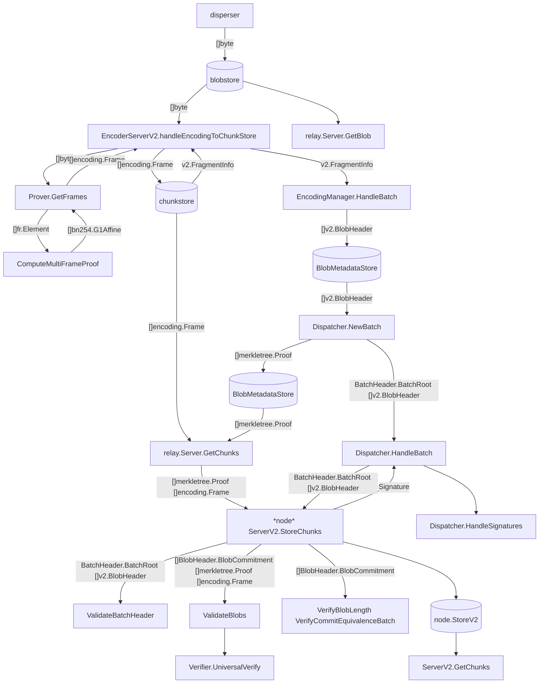

# Math foundation
```
KzgMultiProofGnarkBackend.ComputeMultiFrameProof:
    proof(f) = F * h(f)
             = F * Toeplitz(f) * s
             = F * (Cyc(f2) * s2)[0:l]
             = F * (F2_inv * diag(F2 * f2) * (F2 * s2))[0:l]

SRSTable.PrecomputeSubTable:
    s2[0:l]  = SRSTable.s1[start:start+l]
    s2[l:2l] = 0
    return = F2 * s2

variables:
    f: coefficients
constants:
    s: s^0, s^1, ...
    x: w, w^2, ..., w^l
    F: Fourier Matrix
    l: chunklen
theorems:
    proof(f) = F * h(f)
    h(f) = Toeplitz(f) * s
    Cyc(f) = F_inv * diag(F * f) * F
definitions:
    proof(f)[k] = (f(x) - f(s)) / (x - s), x = w^k
    h(f)[k] = f[k:m] . s[0:m-k]
```

# Data flow diagram

Recommended VS Code extention: [markdown-mermaid](https://marketplace.visualstudio.com/items?itemName=bierner.markdown-mermaid).



# Data structures
```
encoding.Frame: 
    Proof: bn254.G1Affine
    Coeffs: fr.Element

v2.Batch:
    ReferenceBlockNumber: uint64
    []v2.BlobCertificate: v2.BlobHeader

v2.BlobHeader:
    BlobCommitment
        Commitment: []byte
        LengthCommitment: []byte
        LengthProof: []byte
        Length: uint32
```

# Finite field elements
```
fr.Element: [4]uint64
fp.Element: [4]uint64
bn254.G1Affine: [2]fp.Element
```
