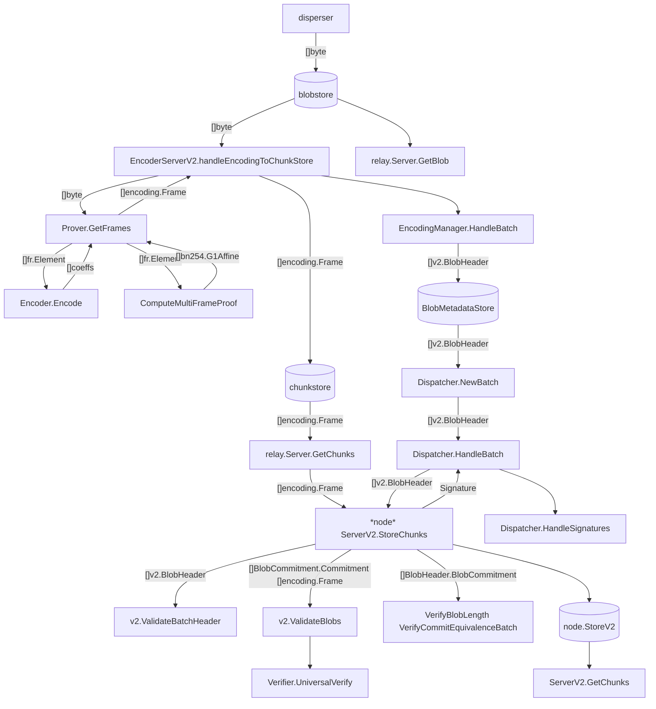

# Refs 

[Layr-Labs/eigenda](https://github.com/Layr-Labs/eigenda)

[Data availability encoding](https://notes.ethereum.org/@dankrad/danksharding_encoding)

[A Universal Verification Equation for Data Availability Sampling](https://ethresear.ch/t/a-universal-verification-equation-for-data-availability-sampling/13240)

[ethereum/consensus-specs/specs/fulu/polynomial-commitments-sampling.md](https://github.com/ethereum/consensus-specs/blob/dev/specs/fulu/polynomial-commitments-sampling.md)

[A Mathematical Theory of Danksharding](https://github.com/ingonyama-zk/papers/blob/main/danksharding_math.pdf)

[KZG polynomial commitments](https://dankradfeist.de/ethereum/2020/06/16/kate-polynomial-commitments.html)

[PCS multiproofs using random evaluation](https://dankradfeist.de/ethereum/2021/06/18/pcs-multiproofs.html)

[Data Availability Sampling Phase 1 Proposal](https://hackmd.io/@vbuterin/das)

[2D data availability with Kate commitments](https://ethresear.ch/t/2d-data-availability-with-kate-commitments/8081)

[ethereum/c-kzg-4844](https://github.com/ethereum/c-kzg-4844)

[Fast amortized Kate proofs](https://github.com/khovratovich/Kate/blob/master/Kate_amortized.pdf)

[Multiplying a Toeplitz matrix by a vector](https://alinush.github.io/2020/03/19/multiplying-a-vector-by-a-toeplitz-matrix.html)

[ingonyama-zk/icicle: A hardware acceleration library for compute intensive cryptography](https://github.com/ingonyama-zk/icicle)

[protolambda/go-kzg: KZG and FFT utils](https://github.com/protolambda/go-kzg)

[A note on data availability and erasure coding](https://github.com/ethereum/research/wiki/A-note-on-data-availability-and-erasure-coding)

[availproject/plonk](https://github.com/availproject/plonk/blob/v0.12.0-polygon-2/src/commitment_scheme/kzg10/key.rs#L297)

# Math

```
    Coeff = F_inv * P * Y // compute Coeff from Y
<=> F * Coeff = P * Y
<=> Y = P * F * Coeff // Y[i] = Coeff(w^rbo(i))
```

# Data flow diagram

Recommended VS Code extention: [markdown-mermaid](https://marketplace.visualstudio.com/items?itemName=bierner.markdown-mermaid)



# Data structures
```
encoding.Frame: 
    Proof:  bn254.G1Affine
    Coeffs: fr.Element

v2.Batch:
    ReferenceBlockNumber: uint64
    BlobCertificates:     []v2.BlobHeader

v2.BlobHeader:
    Commitment:       []byte
    LengthCommitment: []byte
    LengthProof:      []byte
    Length:           uint32
```

# Finite field elements
```
fr.Element: [4]uint64
fp.Element: [4]uint64
bn254.G1Affine: [2]fp.Element
```
