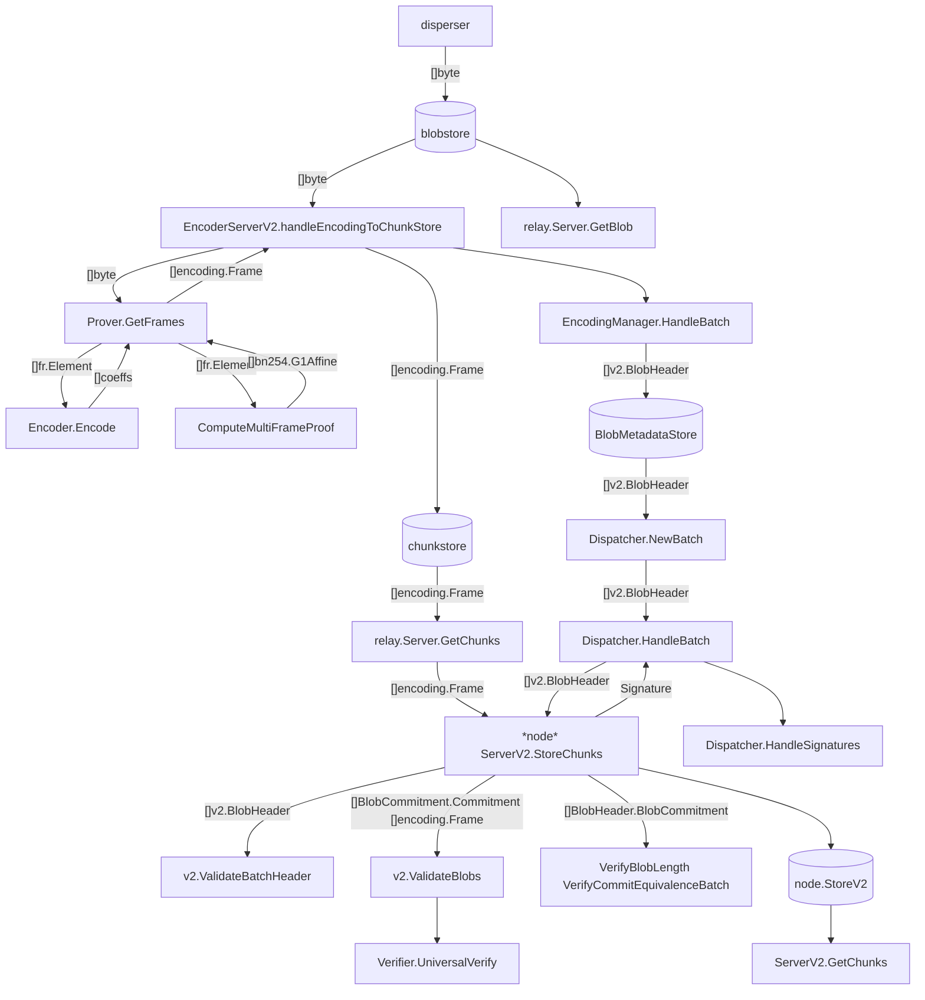

# Refs 

[Layr-Labs/eigenda](https://github.com/Layr-Labs/eigenda)

[Data availability encoding](https://notes.ethereum.org/@dankrad/danksharding_encoding)

[A Universal Verification Equation for Data Availability Sampling](https://ethresear.ch/t/a-universal-verification-equation-for-data-availability-sampling/13240)

[ethereum/consensus-specs](https://github.com/ethereum/consensus-specs#specs): [specs/fulu/polynomial-commitments-sampling.md](https://github.com/ethereum/consensus-specs/blob/dev/specs/fulu/polynomial-commitments-sampling.md)

[A Mathematical Theory of Danksharding](https://github.com/ingonyama-zk/papers/blob/main/danksharding_math.pdf)

[KZG polynomial commitments](https://dankradfeist.de/ethereum/2020/06/16/kate-polynomial-commitments.html)

[PCS multiproofs using random evaluation](https://dankradfeist.de/ethereum/2021/06/18/pcs-multiproofs.html)

[Data Availability Sampling Phase 1 Proposal](https://hackmd.io/@vbuterin/das)

EIP-7594: [From 4844 to Danksharding: a path to scaling Ethereum DA](https://ethresear.ch/t/from-4844-to-danksharding-a-path-to-scaling-ethereum-da/18046)

[Data Availability Summary | l2beat](https://l2beat.com/data-availability/summary)

[2D data availability with Kate commitments](https://ethresear.ch/t/2d-data-availability-with-kate-commitments/8081)

[Fast amortized Kate proofs](https://github.com/khovratovich/Kate/blob/master/Kate_amortized.pdf)

[Multiplying a Toeplitz matrix by a vector](https://alinush.github.io/2020/03/19/multiplying-a-vector-by-a-toeplitz-matrix.html)

[ethereum/c-kzg-4844](https://github.com/ethereum/c-kzg-4844): A minimal implementation of the Polynomial Commitments API for EIP-4844 and EIP-7594.

[ingonyama-zk/icicle](https://github.com/ingonyama-zk/icicle): A hardware acceleration library for compute intensive cryptography.

[protolambda/go-kzg](https://github.com/protolambda/go-kzg): FFT, data-recovery and KZG commitments, in Go.

[A note on data availability and erasure coding](https://github.com/ethereum/research/wiki/A-note-on-data-availability-and-erasure-coding)

[availproject/plonk](https://github.com/availproject/plonk/blob/v0.12.0-polygon-2/src/commitment_scheme/kzg10/key.rs#L297)

# Math
```
    Coeff = F^(-1) * P * Y // compute Coeff from Y
<=> F * Coeff = P * Y
<=> Y = P * F * Coeff // Y[i] = Coeff(w^rbo(i))

theorems:
    P^2 = I // bit reversal permutation matrix
    F = [w^(ij)] where i, j = 0, 1, ..., N-1
    F^(-1) = N^(-1) * [w^(-ij)] where i, j = 0, 1, ..., N-1
```

# EigenDA
```
Encoder.Encode:
    i = 1, 2, ..., n // NumChunks
    j = 1, 2, ..., l // ChunkLength
    rbo(i): ReverseBitsLimited(NumChunks, i)
    encoder.MakeFrames:
        // eval form
        polyEvals = F * pdCoeffs 
    ParametrizedEncoder.MakeFrames:
        // "**" means mul by entry, do sum j when verify in the future
        // f1(w^(rbo(i)x) = F^(-1) * P * polyEvals[rbo(i)] => interpoly(x) = f1(w^(-rbo(i)x)
        // coeff form of interpoly
        frames[i] = [w^(-rbo(i)j): j = 1, 2, ..., l] ** F^(-1) * P * polyEvals[rbo(i)] 
KzgMultiProofGnarkBackend.ComputeMultiFrameProof:
    proof(f) = F * Toeplitz(f) * s
             = F * (Cyc(f2) * s2)[0:n]
             = F * (F_inv * diag(F * f2) * (F * s2))[0:n]
             = F * (F_inv * (F * f2) * (F * s2))[0:n]
             = F * (F_inv * (coeffStore * FFTPointsT))[0:n]
    (coeffStore * FFTPointsT)[i] = coeffStore[i] @ FFTPointsT[i] // i in [0:2n] 
Verifier.UniversalVerify:
    m: numBlobs
    K: randomsFr // k = 1 without loss of generality
    genRhsG1:
        aggCommit: commits @ K // sum over samples in rows
        aggPolyG1: sum_j(frames[i]) @ K
        offsetG1: [w^rbo(samples[k].id): k = 1, 2, ..., K]^l @ proofs @ K // rbo at Verifier.UniversalVerifySubBatch
        rhsG1 = aggCommit - aggPolyG1 + offsetG1
```

# EigenDA data flow diagram


## Data structures
```
encoding.Frame: 
    Proof:  bn254.G1Affine
    Coeffs: fr.Element

v2.Batch:
    ReferenceBlockNumber: uint64
    BlobCertificates:     []v2.BlobHeader

v2.BlobHeader:
    Commitment:       []byte
    LengthCommitment: []byte
    LengthProof:      []byte
    Length:           uint32

Finite field elements:
    fr.Element: [4]uint64
    fp.Element: [4]uint64
    bn254.G1Affine: [2]fp.Element
```
