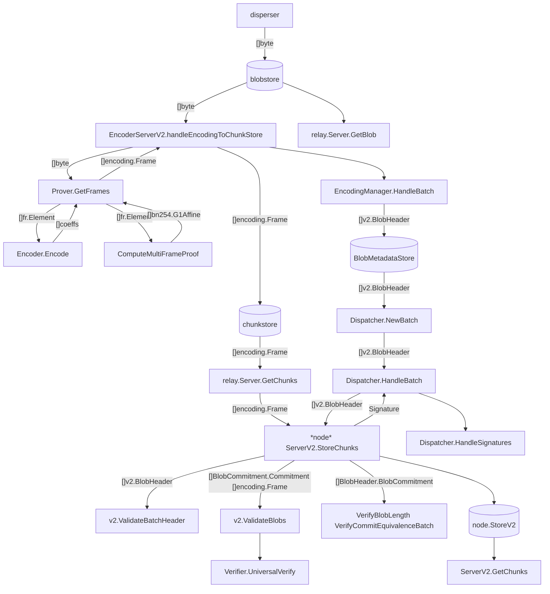

# Data flow diagram



# Tests

Kzg proof: core/v2/core_test.go

Merkel proof: inabox/tests/integration_v2_test.go


# Encoding
```
Encoder.Encode:
    i = 1, 2, ..., n // NumChunks
    j = 1, 2, ..., l // ChunkLength
    rbo(i): ReverseBitsLimited(NumChunks, i)
    encoder.MakeFrames:
        // eval form
        polyEvals = F * pdCoeffs 
    ParametrizedEncoder.MakeFrames:
        // "**" means mul by entry, do sum j when verify in the future
        // f1(w^(rbo(i)x) = F^(-1) * P * polyEvals[rbo(i)] => interpoly(x) = f1(w^(-rbo(i)x)
        // coeff form of interpoly
        frames[i] = [w^(-rbo(i)j): j = 1, 2, ..., l] ** F^(-1) * P * polyEvals[rbo(i)] 
KzgMultiProofGnarkBackend.ComputeMultiFrameProof:
    proof(f) = F * Toeplitz(f) * s
             = F * (Cyc(f2) * s2)[0:n]
             = F * (F_inv * diag(F * f2) * (F * s2))[0:n]
             = F * (F_inv * (F * f2) * (F * s2))[0:n]
             = F * (F_inv * (coeffStore * FFTPointsT))[0:n]
    (coeffStore * FFTPointsT)[i] = coeffStore[i] @ FFTPointsT[i] // i in [0:2n] 
Verifier.UniversalVerify:
    m: numBlobs
    K: randomsFr // k = 1 without loss of generality
    genRhsG1:
        aggCommit: commits @ K // sum over samples in rows
        aggPolyG1: sum_j(frames[i]) @ K
        offsetG1: [w^rbo(samples[k].id): k = 1, 2, ..., K]^l @ proofs @ K // rbo at Verifier.UniversalVerifySubBatch
        rhsG1 = aggCommit - aggPolyG1 + offsetG1
```

# Data structures
```
encoding.Frame: 
    Proof:  bn254.G1Affine
    Coeffs: fr.Element

v2.Batch:
    ReferenceBlockNumber: uint64
    BlobCertificates:     []v2.BlobHeader

v2.BlobHeader:
    Commitment:       []byte
    LengthCommitment: []byte
    LengthProof:      []byte
    Length:           uint32

Finite field elements:
    fr.Element: [4]uint64
    fp.Element: [4]uint64
    bn254.G1Affine: [2]fp.Element
```
